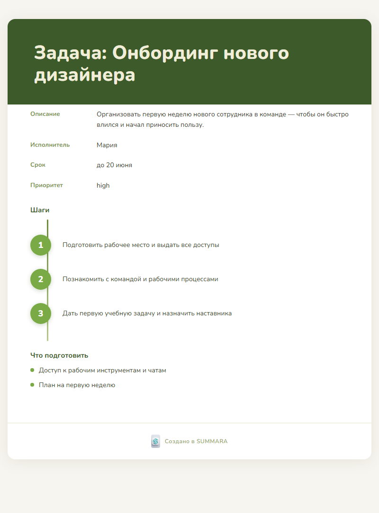
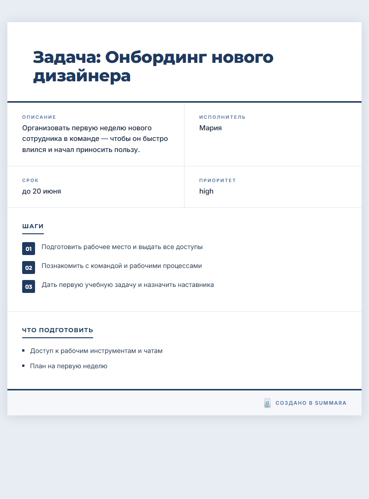
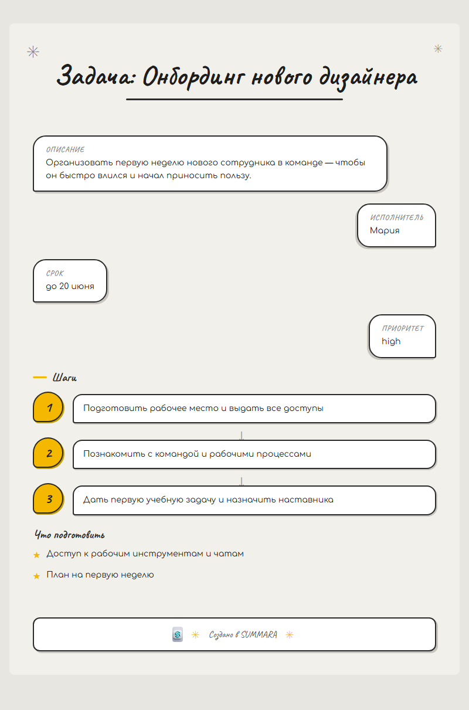
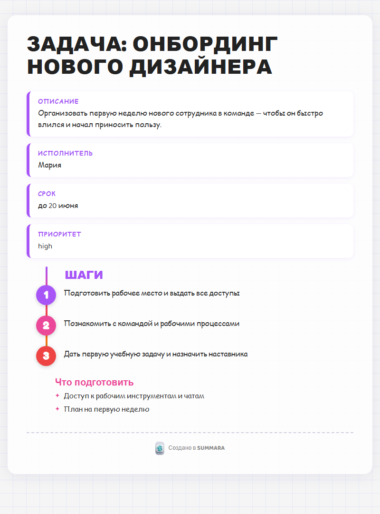
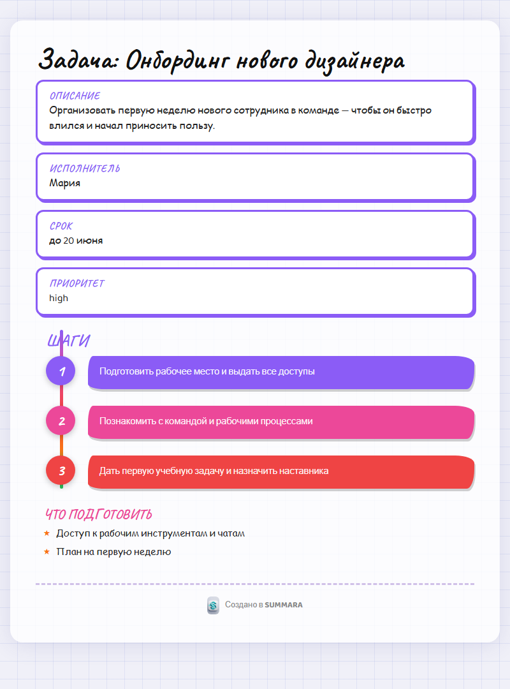
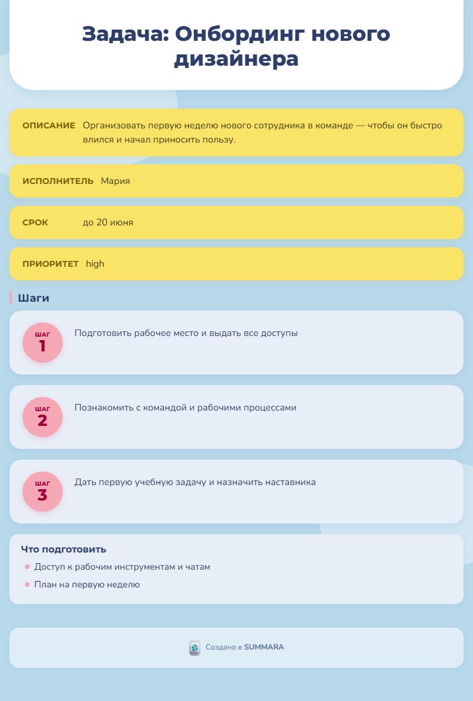
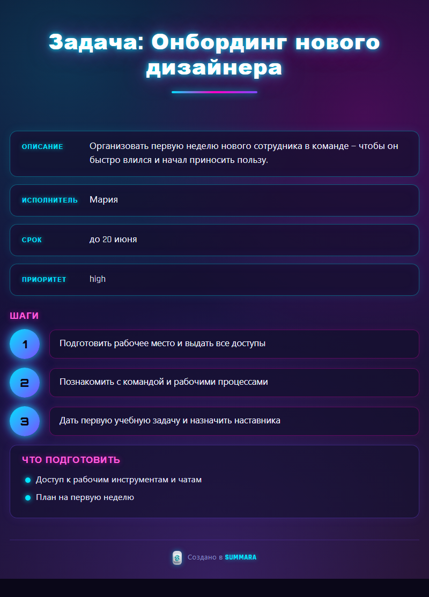
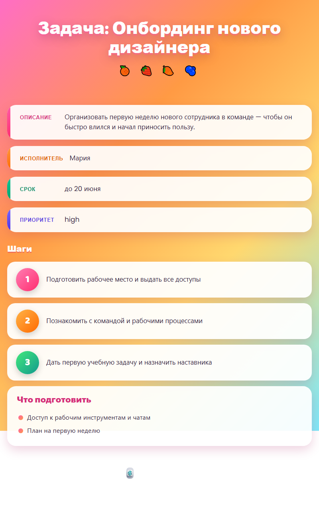

<div align="center">

# 🎙️ SUMMARA

### Голос и текст → красивая структурированная инструкция

**Скажи или напиши сообщение в свободной форме — получи готовый документ**
**(инструкцию, регламент, пояснение) в 8 стилях HTML и 4 стилях PDF.**


</div>

---

## ✨ Что это

Вы наговариваете или вставляете обычный текст —
> «Надо до пятницы подготовить квартальный отчёт, ответственный Иван, приоритет высокий»

а SUMMARA сама:

1. 🎧 **расшифровывает голос** (Whisper, локально, оффлайн),
2. 🧠 **понимает тип** документа — задача / встреча / баг-репорт,
3. 🗂️ **извлекает поля** (исполнитель, срок, приоритет, участники, шаги…),
4. ✅ **проверяет качество** и подсказывает, чего не хватает,
5. ✨ **оживляет текст** по желанию — примеры, пояснения терминов, сноски,
6. 🎨 **оформляет** результат в **8 ярких HTML-страниц** и **4 PDF-стиля**.

Всё — на русском, через Claude API.

---

## 🖼️ Стили оформления

**8 HTML-страниц** генерируются сразу — выбираете понравившуюся:

| Стиль | Настроение |
|---|---|
| 🌿 Спокойный план | мягкий wellness-таймлайн |
| 🏢 Корпоративный | строгий деловой |
| ✍️ Рукописный (doodle) | скетч, речевые пузыри |
| 🗺️ Майнд-карта | яркий таймлайн на клетке |
| 🎨 Брейншторм | сочные мазки краски |
| 👣 Пошаговый процесс | дружелюбные «ШАГ N» |
| 🌃 **Неон** | тёмный киберпанк со свечением |
| 🍊 **Сочный** | насыщенные тропические градиенты |

Плюс **4 PDF-стиля** (Лавандовый, Розовый, Редакционный, Минимальный) и экспорт в TXT / JSON.

### 🎨 Галерея (одна инструкция — 8 оформлений)

<table>
  <tr>
    <td align="center"><b>🌿 Спокойный план</b><br></td>
    <td align="center"><b>🏢 Корпоративный</b><br></td>
    <td align="center"><b>✍️ Рукописный</b><br></td>
    <td align="center"><b>🗺️ Майнд-карта</b><br></td>
  </tr>
  <tr>
    <td align="center"><b>🎨 Брейншторм</b><br></td>
    <td align="center"><b>👣 Пошаговый процесс</b><br></td>
    <td align="center"><b>🌃 Неон</b><br></td>
    <td align="center"><b>🍊 Сочный</b><br></td>
  </tr>
</table>

---

## 🚀 Быстрый старт

```bash
# 1. Зависимости
python -m venv .venv
.venv\Scripts\python.exe -m pip install -r requirements.txt   # Windows
# .venv/bin/pip install -r requirements.txt                   # macOS/Linux

# 2. Ключ API — скопируйте шаблон и впишите свой ключ
copy .env.example .env        # Windows  (cp .env.example .env — *nix)
#   ANTHROPIC_API_KEY=sk-ant-...

# 3. Запуск
.venv\Scripts\python.exe app.py
```

Откройте **http://localhost:7860** 🎉

> Нужен ключ Anthropic — получить на [console.anthropic.com](https://console.anthropic.com/settings/keys).
> Первая транскрипция скачает модель Whisper (~145 МБ для `base`).

---

## 🧭 Как пользоваться

1. **Голос** — запишите с микрофона или загрузите аудио (mp3/wav/m4a/ogg) → «Транскрибировать».
   **Текст** — просто вставьте сообщение.
2. (по желанию) включите **✨ «Сделать текст живее»** — добавит примеры, пояснения, сноски.
3. Нажмите **«⚡ Сгенерировать инструкцию»**.
4. В блоке **«Сохранение результата»** выберите формат:
   **Веб-страница (HTML)** → создаются все 8 вариантов с превью; либо TXT / JSON / PDF.

### ⚙️ Настройки

В разделе **«Настройки обработки текста»** можно на лету менять:
- **вид итогового документа** (инструкция → регламент, пояснение, памятка, чек-лист…),
- **промпты** обработки текста (роль редактора и правила).

---

## 🔌 MCP-сервер (Claude Desktop)

SUMMARA работает как набор инструментов прямо внутри Claude Desktop.

`%APPDATA%\Claude\claude_desktop_config.json`:
```json
{
  "mcpServers": {
    "summara": {
      "command": "C:/путь/к/summara/.venv/Scripts/python.exe",
      "args": ["C:/путь/к/summara/summara_mcp/mcp_server.py"]
    }
  }
}
```

Инструменты: `generate_instruction`, `generate_instruction_with_pdfs`,
`generate_landing` (HTML во всех стилях), `export_pdfs`, `transcribe_audio`.
Подробнее — `summara_mcp/README.md`.

---

## 🏗️ Как устроено

```
Голос/Текст
   │  faster-whisper (локально)
   ▼
Классификатор → Экстрактор → Рендер (Jinja2) → [Обогащение] → Валидатор
   │  Claude          Claude        templates/      enricher       Claude
   ▼
PDF (ReportLab) · HTML (8 стилей) · TXT · JSON
```

| Слой | Файлы |
|---|---|
| Оркестрация | `pipeline.py` |
| Агенты | `agents/` (transcription, classifier, extractor, validator, enricher) |
| Экспорт | `agents/pdf_export.py`, `agents/html_export.py` (+ `html_templates.py`, `_tpl_*.py`) |
| Шаблоны/схемы | `templates/*.yaml`, `models/schemas.py` |
| UI / MCP | `app.py`, `summara_mcp/mcp_server.py` |
| Настройки | `settings.py`, `config.py` |

Подробный гайд для контрибьюторов и Claude Code — в [`CLAUDE.md`](CLAUDE.md).

---

## ➕ Добавить свой тип документа

1. `templates/my_type.yaml` — структура + Jinja2-шаблон вывода.
2. Pydantic-схема в `models/schemas.py` → добавить в `SCHEMA_MAP`.
3. Метка в `app.py` → `TEMPLATE_LABELS`.

Перезапустить — готово.

---

## 🛠️ Стек

`Python` · `Gradio` · `Anthropic Claude (Sonnet)` · `faster-whisper` ·
`Pydantic` · `Jinja2` · `ReportLab` · `MCP` · `PyYAML`

---

## 🔐 Безопасность

Ключ API хранится только в `.env` (в `.gitignore`). В `.env.example` — лишь placeholder.
Никакие ключи не попадают в репозиторий.

## 📄 Лицензия

[MIT](LICENSE) — используйте свободно.

<div align="center">
<sub>Создано с ❤️ — SUMMARA</sub>
</div>
